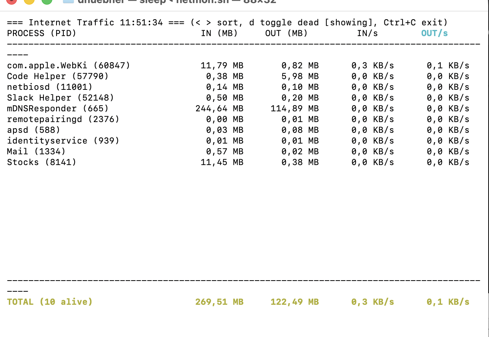

# NetMon - Network Traffic Monitor for macOS

A real-time network traffic monitoring script for macOS Terminal that displays internet traffic with per-second rates, process tracking, and interactive controls.

## Features

- **Real-time monitoring** - Updates every 2 seconds showing current network activity
- **Process-based tracking** - Monitors traffic by process name with current PID display
- **Internet-only traffic** - Filters out localhost and local network traffic (192.168.x.x, 10.x.x.x, etc.)
- **Historical tracking** - Maintains cumulative traffic statistics across process restarts
- **Interactive sorting** - Sort by process name, total traffic, or current rates
- **Dead process tracking** - Option to show/hide processes that are no longer active
- **Color-coded display** - Easy-to-read color formatting with highlighted sort columns

## Requirements

- macOS (uses `nettop` command)
- Terminal with color support
- zsh shell (default on modern macOS)

## Installation

1. Make the script executable:

```bash
chmod +x netmon.sh
```

2. Run the script:

```bash
./netmon.sh
```

## Usage

The script displays network traffic in a table format with the following columns:

| Column | Description |
|--------|-------------|
| PROCESS (PID) | Process name with current Process ID |
| IN (MB) | Total data received (cumulative) |
| OUT (MB) | Total data sent (cumulative) |
| IN/s | Current incoming data rate (KB/s) |
| OUT/s | Current outgoing data rate (KB/s) |

### Example Output



*Example showing various processes with their network activity. Notice how mDNSResponder has the highest cumulative traffic, while com.apple.WebKit shows active incoming traffic.*

### Interactive Controls

- **`<` or `,`** - Sort by previous column
- **`>` or `.`** - Sort by next column
- **`d` or `D`** - Toggle display of dead processes
- **`Ctrl+C`** - Exit the monitor

### Display Features

- **Active processes** - Shown in normal text with current rates
- **Dead processes** - Shown in dim text with dashes for rates (when enabled)
- **Sort indicator** - Current sort column is highlighted in cyan
- **Status line** - Shows current time, controls, and dead process toggle state
- **Summary row** - Displays totals and count of alive/dead processes

## How It Works

1. **Data Collection**: Uses macOS `nettop` command to gather network statistics
2. **Filtering**: Excludes local network traffic (localhost, LAN addresses)
3. **Process Aggregation**: Groups traffic by process name, tracking across PID changes
4. **Rate Calculation**: Computes per-second rates from periodic samples
5. **Persistent Tracking**: Maintains history in temporary files for session duration

## Technical Details

- **Update Interval**: 2 seconds for data refresh
- **Poll Interval**: 0.1 seconds for keyboard input
- **Maximum Rows**: 20 processes displayed at once
- **Minimum Traffic**: Only shows processes with >10KB total traffic
- **Cleanup**: Automatically removes temporary files on exit

## Troubleshooting

### Script doesn't show any processes

- Ensure you have network activity (try browsing the web)
- Check that `nettop` command is available and working
- The script only shows processes with significant network activity (>10KB)

### Permission issues

- The script uses standard macOS commands and doesn't require special permissions
- If you encounter issues, try running from a different terminal or restarting Terminal.app

### No color output

- Ensure your terminal supports ANSI color codes
- Most modern terminals (Terminal.app, iTerm2) support colors by default

## File Structure

The script creates temporary files in `/tmp/` during operation:

- `nettop_prev_*` - Previous readings for rate calculation
- `nettop_history_*` - Process history and cumulative statistics
- `nettop_curr_*` - Current nettop output processing

All temporary files are automatically cleaned up when the script exits.

## Author

Created for monitoring internet traffic on macOS systems with a focus on clarity and ease of use.

## License

This script is provided as-is for educational and monitoring purposes.
